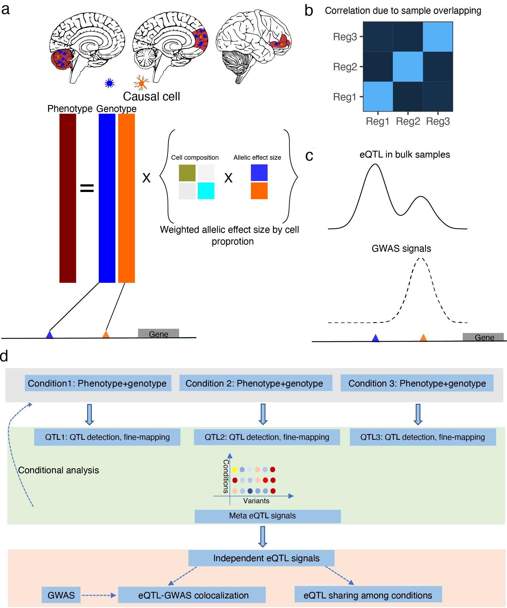

# mmQTL: multivariate multiple QTL

mmQTL is a flexible software toolkit used to conduct multiple QTL detection with control for population structure and sample overlapping.

Any bugs, please contact biao.zeng@mssm.edu or jxzb1988@gmail.com

Currently, mmQTL is supported for 64-bit Linux platforms. 


* [Key features](#key-features)
* [Installation](#installation)
  * [Precompiled binaries](#precompiled-binaries)
* [Run mmQTL](#run-mmQTL)
* [Building from source](#building-from-source)
* [Input data formats](#input-data-formats)
* [Credits](#credits)

## Key features

1. Control for population structure;

2. Control for sample overlapping;

3. Meta-analysis to integrate QTL signal among conditions;

4. Conditional analysis to find independent QTL signals.

## Installation

To install mmQTL you can

1. Download the precompiled binaries (64-bit Linux only);

2. Compile mmQTL from source.

## Run mmQTL

To get mmQTL running options, you can type

```
sh MMQTL23 -h
```

Example code

```
MMQTL23 -b  -P  pheno_file.txt   -Z  geno_file.txt   -R GRM_file.txt -a feature_annotation.txt  -A random   -gene  gene_name 
```

Given that we have 5 tissues/conditions, named as condition1, condition2, condition3, condition4, condition5. 

For phenotype, the phenotype files (gxn matrix, g is the number of explored genes, and n is the sample size) are named as phenotype_file_1, phenotype_file2, phenotype_file3, phentoype_file4, phenotype_file5;

For genotype, the binary plink-format genotype file are named as genotype_file_1, genotype_file_2, genotype_file_3, genotype_file_4, genotype_file_5;

You need an annotation file for the exploed features a bed format: chr start end feature_name;

Optional, to perform mixed linear model for control for population strucutre, you need to provide GRM file, nameds as GRM_file_1, GRM_file_2, GRM_file_3, GRM_file_4, GRM_file_5.

explanation for parameters: 

-P: specify the location of the file containing the location of phenotype files for each tissue/condition;


This file should be: 

```
path to phenotype_file_1
path to phentoype_file_2
path to phenotype_file_3
path to phentoype_file_4
path to phentoype_file_5
```

-Z: specify the location of the file containing the location of genotype files for each tissue/condition. The format for the genotype should be in PLINK format

This file should be: 

```
path to genotype_file_1
path to genotype_file_2
path to genotype_file_3
path to genotype_file_4
path to genotype_file_5
```

-R: specify the location of the file containing the location of genetic relatedness matrix files for each tissue/condtional.

This file should be: 

```
path to GRM_file_1
path to GRM_file_2
path to GRM_file_3
path to GRM_file_4
path to GRM_file_5
```

-A: run mmQTL in random-effect or fixed-effect model when performing meta-analysis.

-gene: Specify the gene/feature for which that you want to detect eQTL.

## Building from source

make

## Input data formats

Currently mmQTL takes PLINK format for genotype, and text for phenotype

## Credits

Biao Zeng, Icahn School of Medicine at Mount Sinai

1470 Madison Ave

The Leon and Norma Hess Center for Science and Medicine

New York, NY 10029


